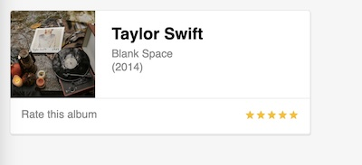

# Component SCSS

I installed SASS and I worked with .scss files for this project. 
I created a card component that displays an album cover and some information. 

To do the stars rating I used the following library:
- [react-simple-star-rating](https://github.com/awran5/react-simple-star-rating)

## Demo 
